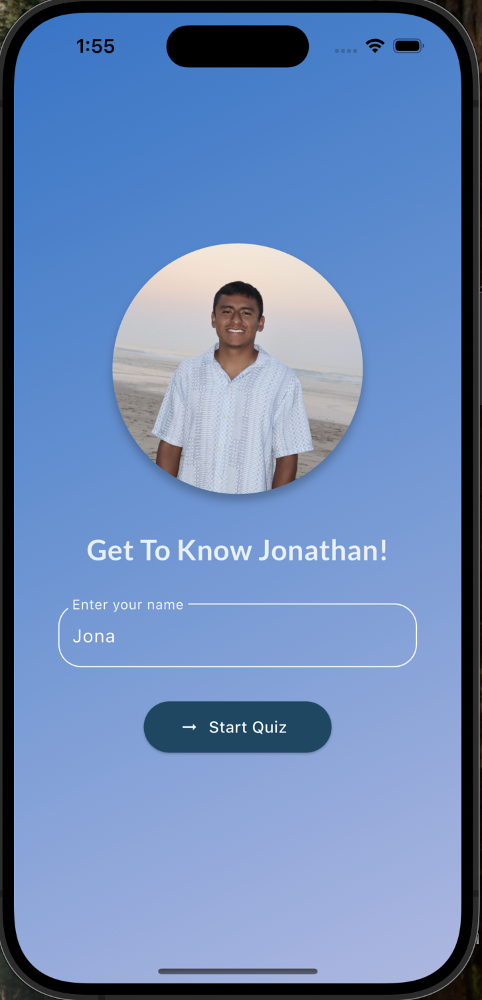
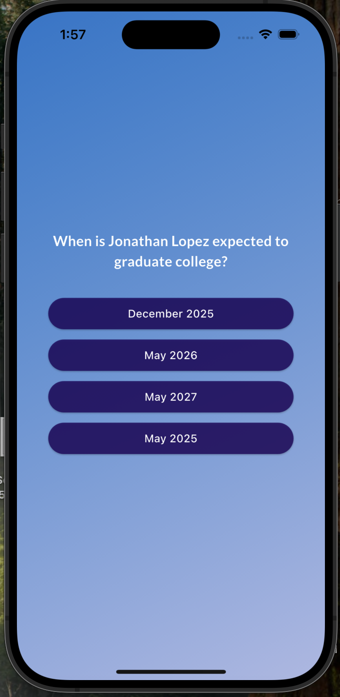
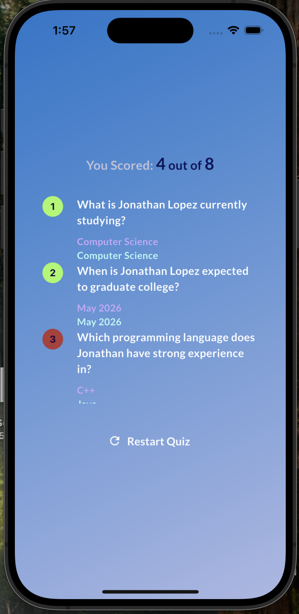

A fun and interactive quiz app built with Flutter & Dart.

This project showcases fundamentals of Flutter development including state management, navigation, UI design, and API/database integration. The quiz contains questions about Jonathan Lopez.

- Interactive quiz flow with multiple-choice questions.
- Tracks user answers and displays results at the end.
- Simple, clean UI using Flutter widgets and Google Fonts.
- Ready for integration with APIs or databases.

  
 |  | 
